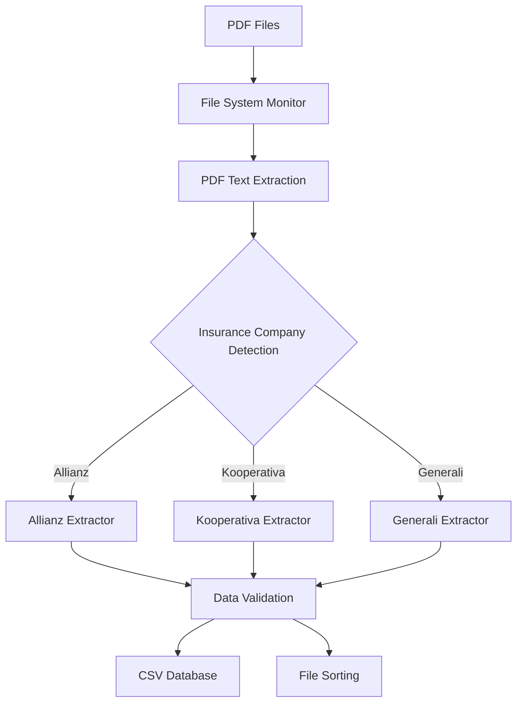

# Insurance PDF Parser

A Python application that automatically monitors directories for PDF insurance documents and extracts structured data into CSV format. Currently supports three major Czech insurance companies: **Allianz**, **Kooperativa**, and **Generali**.

## 📋 Table of Contents

- [Features](#features)
- [Supported Insurance Companies](#supported-insurance-companies)
- [Prerequisites](#prerequisites)
- [Installation](#installation)
- [Configuration](#configuration)
- [Usage](#usage)
- [Data Structure](#data-structure)
- [Architecture](#architecture)
- [Error Handling](#error-handling)
- [Contributing](#contributing)
- [License](#license)

## ✨ Features

- **Real-time monitoring** - Automatically processes new PDF files as they arrive
- **Multi-company support** - Handles different PDF formats from major Czech insurers
- **Data extraction** - Extracts 30+ insurance policy fields per document
- **CSV database** - Maintains structured data in easily accessible format
- **Error handling** - Robust error management with file sorting
- **Professional logging** - Comprehensive status reporting and debugging
- **Type safety** - Full type hints for better code maintainability

## 🏢 Supported Insurance Companies

| Company | Document Types | Status |
|---------|----------------|---------|
| **Allianz** | Insurance quotes, policies | ✅ Active |
| **Kooperativa** | Insurance quotes, policies | ✅ Active |
| **Generali** | Insurance quotes, policies | ✅ Active |

## 📋 Prerequisites

- Python 3.6 or higher
- macOS/Linux/Windows operating system
- PDF files with extractable text (not scanned images)

## 🚀 Installation

1. **Clone the repository**
   ```bash
   git clone https://github.com/JirkaEifler/Insurance-PDF-Parser
   cd Insurance_PDF_Parser
   ```

2. **Install required dependencies**
   ```bash
   pip install -r requirements.txt
   ```

## ⚙️ Configuration

Update your own local configuration in the file: PDF_Parser/config.py

```python
# Directory paths configuration
WATCH_FOLDER = "/path/to/your/pdf/folder"
CSV_PATH = "/path/to/output/insurance_data.csv"
SORTED_FOLDER = "/path/to/processed/files"
ERROR_FOLDER = "/path/to/error/files"
```

### Directory Structure
```
your_project/
├── PDFka/              # Input folder (WATCH_FOLDER)
├── ZPRACOVANE/         # Successfully processed files
├── CHYBY/              # Files with processing errors
└── EVIDENCE_UDAJE_AUTA.csv  # Output database
```

## 🎯 Usage

### Basic Usage

1. **Start the monitoring service**
From the project root folder (the one that contains PDF_Parser/), run:
   ```bash
   python -m PDF_Parser.pdf_parser
   ```
This is necessary because the script uses relative imports like:
   ```bash
from PDF_Parser.config import ...
   ```

2. **Add PDF files** to the watch directory

3. **Monitor the output** - The application will:
   - Detect new PDF files automatically
   - Extract insurance data
   - Save to CSV database
   - Move processed files to appropriate folders

### Sample Output
```
👀 Monitoring folder for new PDF files (Allianz, Kooperativa, Generali)...
📁 Watch folder: /Users/example/PDFka
📊 CSV output: /Users/example/EVIDENCE_UDAJE_AUTA.csv
✅ Processed files: /Users/example/ZPRACOVANE
❌ Error files: /Users/example/CHYBY
------------------------------------------------------------
📥 New PDF file detected: allianz_quote_12345.pdf
🏢 Processing Allianz document
✅ Data extracted and file processed successfully.
```

## 📊 Data Structure

The application extracts the following fields from each insurance document:

### Personal Information
- `Jméno a příjmení` - Full name
- `Rodné číslo` - Czech birth number
- `Datum narození` - Birth date
- `Adresa` - Address
- `Telefon` - Phone number (9-digit format)
- `E-mail` - Email address

### Policy Information
- `Číslo smlouvy` - Contract number
- `Počátek pojištění` - Insurance start date
- `Cena` - Premium amount
- `Krytí PR` - Liability coverage limits

### Vehicle Information
- `SPZ` - License plate
- `Cena vozidla` - Vehicle price
- `Najeté km` - Current mileage
- `Roční nájezd` - Annual mileage

### Coverage Details
- `Havarijní pojištění` - Comprehensive insurance (YES/NO)
- `Další připojištění` - Additional coverage packages

### Entity Information
- `Pojistník - Typ osoby` - Policyholder type
- `Shodný provozovatel` - Same operator (YES/NO)
- `Shodný vlastník` - Same owner (YES/NO)

## 🏗️ Architecture

### Core Components



### Key Classes and Functions

- **`PDFHandler`** - File system event handler
- **`extract_data_allianz()`** - Allianz document processor
- **`extract_data_koop()`** - Kooperativa document processor  
- **`extract_data_generali()`** - Generali document processor
- **Helper functions** - Phone cleaning, birth date parsing

## 🚨 Error Handling

The application includes comprehensive error handling:

### Automatic Error Management
- **Invalid PDFs** → Moved to error folder
- **Unsupported formats** → Logged and sorted
- **Extraction failures** → Detailed error reporting
- **Missing text** → Graceful skipping

### Monitoring and Debugging
```bash
# Check processing status
tail -f application.log

# Monitor error folder
ls -la /path/to/CHYBY/
```

## 🔧 Development

### Adding New Insurance Companies

1. **Create extraction function**:
   ```python
   def extract_data_newcompany(text: str, filename: str) -> Dict[str, Any]:
       """Extract data from NewCompany PDF documents."""
       data = extract_common_fields()
       # Add extraction logic
       return data
   ```

2. **Update detection logic**:
   ```python
   elif "newcompany" in text_lower:
       data = extract_data_newcompany(text, filename)
   ```

### Testing
*(Not implemented yet)*

## 🤝 Contributing

1. Fork the repository
2. Create a feature branch (`git checkout -b feature/amazing-feature`)
3. Commit your changes (`git commit -m 'Add amazing feature'`)
4. Push to the branch (`git push origin feature/amazing-feature`)
5. Open a Pull Request

### Contribution Guidelines
- Follow Python PEP 8 style guide
- Add docstrings for new functions
- Include type hints
- Test with sample PDF files
- Update README for new features

## 📄 License
- This project is proprietary software.
- © 2025 Jiří Eifler. 
- All rights reserved. 
- No part of this repository may be copied, modified, distributed, or used without explicit written permission from the author.

## 🆘 Support

### Common Issues

**Q: PDF files are not being processed**
- Ensure PDFs contain extractable text (not scanned images)
- Check file permissions on watch directory
- Verify PDF files are from supported insurance companies

**Q: Missing data in CSV output**
- PDF format may have changed - check extraction patterns
- Some fields may not be present in all document types
- Review error logs for specific extraction failures

**Q: Application stops unexpectedly**
- Check available disk space
- Verify write permissions for output directories
- Review system logs for memory issues

### Getting Help
- **Email**: jirka.eifler@gmail.com

---

**Made with ❤️ for insurance data automation**
